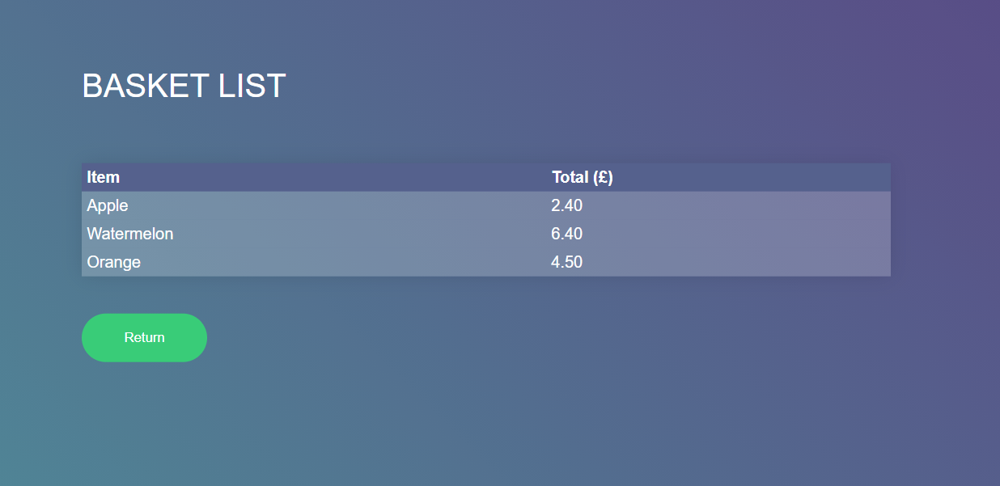

# SimpleMarket

## Description

We are a national supermarket chain that is interested in starting to use special offers in our stores. We stock the following products:

| Item       | Price (£) |
|------------|:---------:|
| Apple      | 0.20      |
| Orange     | 0.50      |
| Watermelon | 0.80      |

We would like to allow the following special offers:

- Buy One Get One Free on Apples

- Three For The Price Of Two on Watermelons

We would like to see the output for an example basket containing the following items:

| Item       | Quantity  |
|------------|:---------:|
| Apple      | 4         |
| Orange     | 3         |
| Watermelon | 5         |

#### Notes

This application is using SpringBoot and have pseudo REST API (localhost:8080).

-------

    
    

